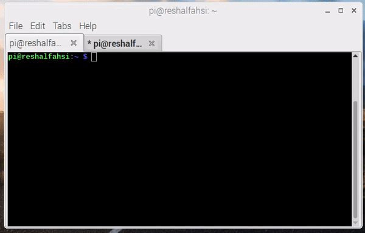

# RASPBERRY PI KERNEL NAME EDITING
This repository is for exercise of Embedded Operating System course (TKEE163251) in Electrical and Information Engineering of Universitas Gadjah Mada.

## Requirement
* Raspberry Pi 3B/3B+
* PC
* SDCard

## Disclaimer
This tutorial is using cross-compiler building instead of local building, for further information please kindly check [here](https://www.raspberrypi.org/documentation/linux/kernel/building.md).

## How to Use:
* Run kernel-name-editing.sh.
* Insert your SDCard into your pc and check whether you have sdc or sdb. Hint use: lsblk command in terminal.
* If you have sdb then run sdb-install.sh else run sdc-install.sh.
* Voila! You got your own custom name of raspbian kernel.

## Special Thanks to
* Agus Bejo, S.T., M.Eng., D.Eng.
* [Kevin Aldian Winanta](https://github.com/kevinaldianw)
* Bagaskara Primastya Putra
